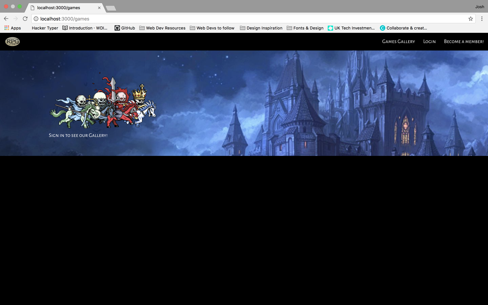
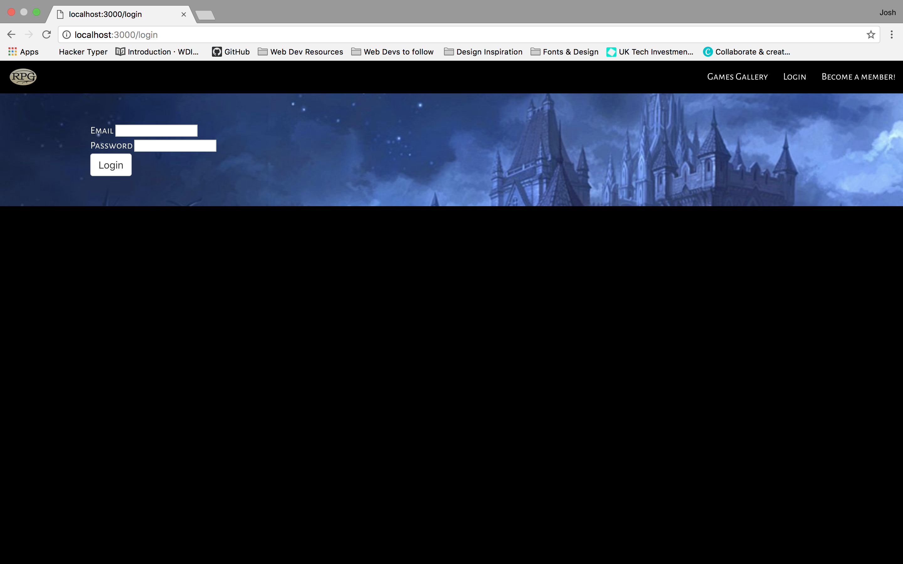
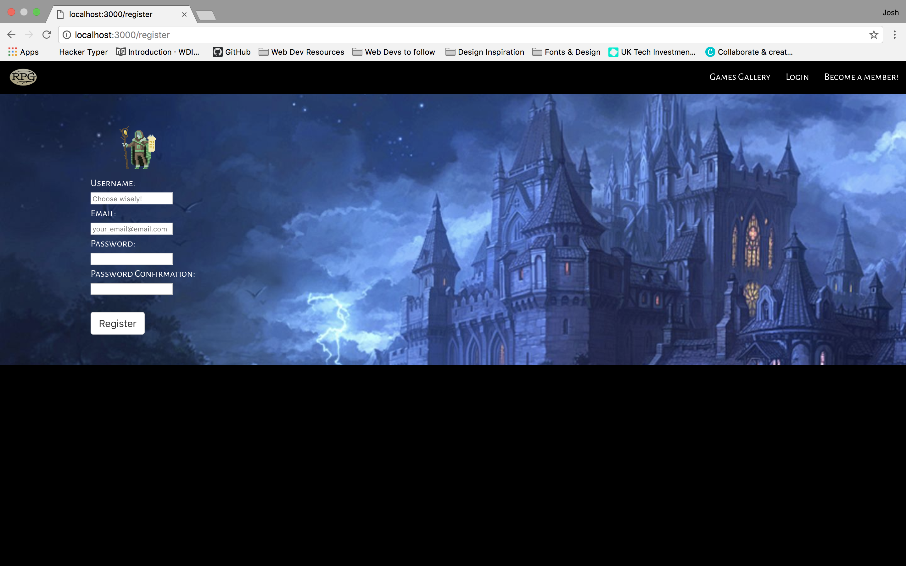

# Project2_Games_Platform

# GA WDI-34 Project 2 - RPG Games Platform
For our second project, we were given a week to build a site using NodeJS, MongoDB, Api's, HTML, CSS and JS. I chose to make a platform in which users could upload Role-Playing Games, review them and comment on other games that people had uploaded.

##### [Visit website]() for best playing experience (the game was not designed for mobile).
---
<!-- ## Setup instructions
- Clone or download the repo
- Install dependencies with `yarn install`
- Launch the app with `gulp` -->

---
# Overveiw of the RPG Games Platform

The landing page is a simple page, as I wanted a clean feel to the site, with a beautiful image and concise Nav bar features neatly set in in the top nav bar.

 

I decided to make the site accessible for logged in users only. I set this page with a fun little gif telling visitors to log in before the entire gallery would become available for them. 

This is the Login page for users that have already registered.

 I decided for the registration page that i would follow a similar theme to the landing page and keep it simple with an added gif of a wizard holding a form as an added interest feature.

 IF the player should reach 0 health while attacking or going into combat with one of the monsters, then an alert comes up with some flavour text telling the player that they have failed, I set the page to reload after the user had finished reading and clicked the ok button.

 

 
<h2>Things I would like to add to the game:</h2>
 
I would like to find a way to create procedurally generated random maps, with random item and monster locations.

 
I would like to have at least 1 or 2 more enemy variants to make the game a little bit more fun and also style wise to look better.

 
In the future I would like to design sprites sheets specifically for the game to allow me to use more textures, as well as some animation in both the player and the
monsters.

3 Boss battles ranging from easy to hard, I wanted this feature in the game however It did not make it into the final product. The Boss images in the game are all that remain of the idea.

---
# Final Thoughts

I found this project to be challenging and incredibly frustrating at times, however it was incredibly rewarding to get everything to work the way i envisioned it. To take the concept of the game from the pages of my notebook to being a fully functional game which has been deployed is a great feeling.
I am overall happy with how the game turned out, I would of liked to have bosses in the game, however i ran out of time and I wanted to get the game finished in order to style and polish the project.
I shall be working on the game in my spare time and In doing so I hope to watch it grow with my abilities as a Developer.
